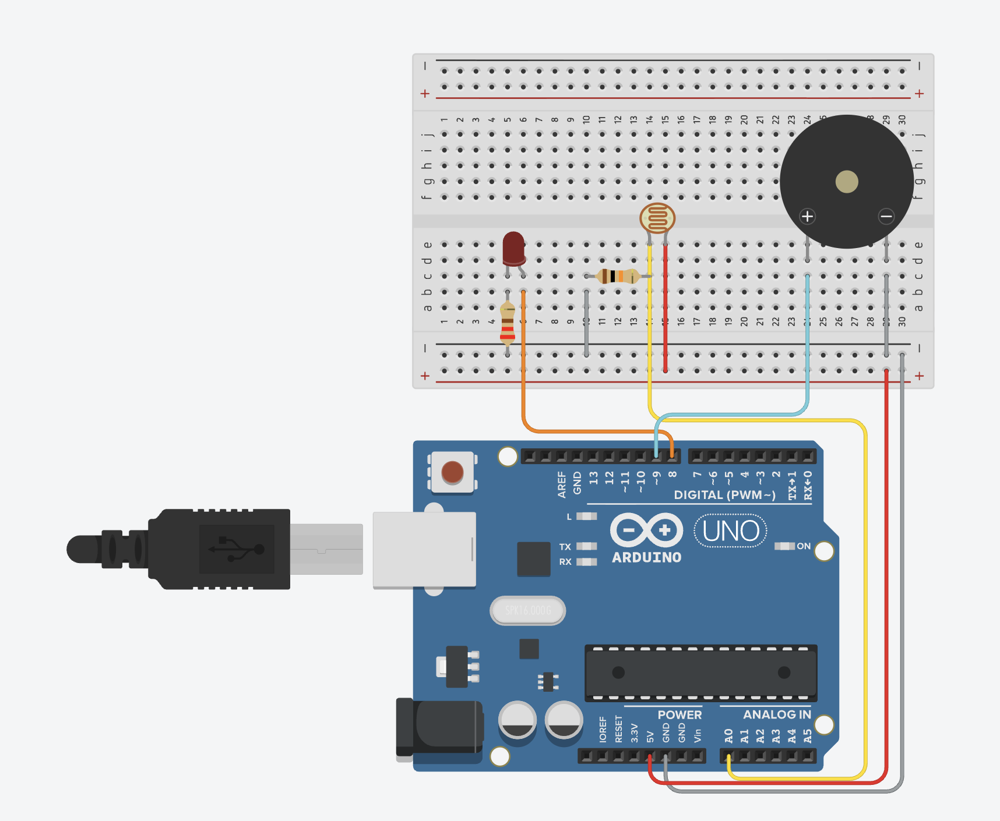

## Circuit Diagram

# Laser Tripwire Alarm

## Description
A laser-style intrusion detection system using an LDR sensor.

## Features
- LDR light detection
- Intrusion alarm
- LED status indicator
- Piezo buzzer alert

## Components
- Arduino Uno
- Photoresistor (LDR)
- LED
- Buzzer
- 10kΩ Resistor
- 220Ω Resistor
