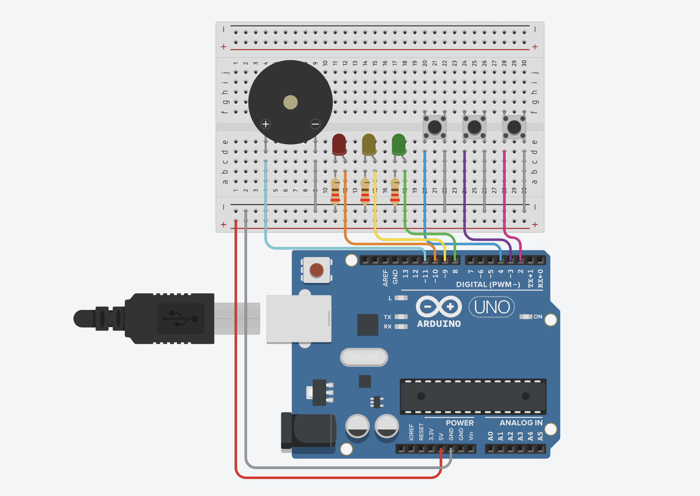

## Circuit Diagram

# Network IDS Simulator

A simple Arduino-based Intrusion Detection System (IDS) simulator.

## Features
- Normal Traffic Detection
- Suspicious Traffic Warning
- DDoS Attack Alert
- LED Status Indicators
- Buzzer Alarm
- Serial Monitor Logs
